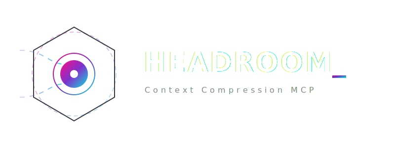
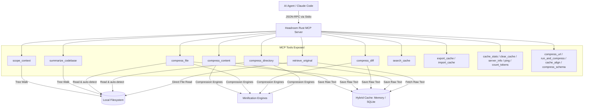

<p align="center">
  
</p>

<p align="center"><strong>A high-performance, zero-dependency context compression layer and DOX scoping companion for AI coding agents, implemented as a native Rust MCP Server.</strong></p>

<p align="center">
  <a href="https://github.com/aswin402"></a>
  <a href="https://github.com/agent0ai/dox"></a>
  <a href="https://github.com/chopratejas/headroom"></a>
</p>

---

## 📖 Table of Contents

1. [What It Does](#-what-it-does)
2. [Key Features](#-key-features)
3. [Architecture & Data Flow](#-architecture--data-flow)
4. [Inspirations & Design Philosophy](#-inspirations--design-philosophy)
5. [The 19 MCP Tools Exposed](#-the-19-mcp-tools-exposed)
6. [CLI Configuration & Flags](#-cli-configuration--flags)
7. [Subcommands & Offline Analytics](#-subcommands--offline-analytics)
8. [Command-Specific Minifiers](#-command-specific-minifiers)
9. [Performance & Resource Footprint](#-performance--resource-footprint)
10. [Competitive Comparison Matrix](#-competitive-comparison-matrix)
11. [Client Configuration](#-client-configuration)
12. [Files Reference](#-files-reference)

---

## 💡 What It Does

**Headroom MCP** sits between your AI coding agent (like Claude Code, Claude Desktop, Cursor, or Aider) and your local development workspace. It acts as an invisible, local-first context controller that optimizes the LLM context window using two primary strategies:

1. **Dynamic Context Scoping (DOX Pattern):** Aggregates folder-specific instruction files (`AGENTS.md`, `CLAUDE.md`, `CURSOR.md`, `.cursorrules`) hierarchically from the root repository down to the active file directory, preventing the LLM from loading bloated, irrelevant instructions.
2. **Reversible Local Compression (CCR):** Deterministically compresses heavy JSON arrays, CSV datasets, unified diffs, source files, and verbose terminal outputs, substituting them with short structured summaries and reference tags (e.g. `[CCR Ref: ccr_72fa11]`). If the agent needs to inspect the full trace later, it invokes the `retrieve_original` tool to fetch the raw text from a high-speed hybrid cache (in-memory or SQLite-backed).

> [!IMPORTANT]
> Headroom MCP is **not** a cloud service or an ML model. It is a single compiled binary that runs 100% locally alongside your agent process with sub-millisecond execution latencies.

---

## ⚡ Key Features

*   **Syntax-Aware Signature Extraction:** Extract lightweight, structural signature-only representations for Rust, Python, and JavaScript/TypeScript. Replaces function and class bodies with `{ ... }` while retaining type signatures, imports, structs, and interfaces.
*   **Command-Specific Minifiers:** Deep semantic parsers for output of tools like `cargo test`, `npm run build`, `git diff`, and `pytest`. Suppresses compiler progress lines, download logs, and passing test results while highlighting errors, warnings, and failures.
*   **HTTP Scraping & Page Compressing (`compress_url`):** Safely fetches external HTML pages or APIs with a timeout, cleaning the markup into formatted markdown before passing it through the compression pipeline.
*   **Command Sandbox Executor (`run_and_compress`):** Safely runs shell commands inside your workspace directory and captures stdout/stderr, compressing output on the fly to protect the LLM context.
*   **Context Optimizers (`cache_align` & `compress_schema`):** Maximize provider-side caching by aligning, wrapping, and padding context chunks, and strip verbose metadata/descriptions from tool schemas to save prompt tokens.
*   **YAGNI Behavioral Injection (`--enforce-yagni`):** Actively injects a cognitive minimalism ladder into the scoped rules aggregation to nudge agents to reuse code, standard libraries, and native APIs before over-engineering new dependencies.
*   **Offline Session Analytics:** Query historical statistics, compression savings, and token/USD cost metrics directly from the SQLite database using native subcommands.

---

## 🏗️ Architecture & Data Flow



---

## 🧠 Inspirations & Design Philosophy

Headroom MCP was built on the shoulders of several cutting-edge developer tools and AI optimization projects, adapting their principles into a native, high-performance Rust architecture:

### 1. [chopratejas/headroom](https://github.com/chopratejas/headroom) (Context Compression)
*   **Inspiration:** The original concept of dynamically compressing verbose file formats and logs to save context window headroom.
*   **Headroom Synthesis:** While the original Python project leverages heavy machine learning and embedding models, Headroom MCP transitions to a deterministic, local-first model, bringing the same core concept down to sub-millisecond speeds with zero ML runtime overhead.

### 2. [agent0ai/dox](https://github.com/agent0ai/dox) (Directory Scoping)
*   **Inspiration:** The directory-level scoping mechanism (DOX pattern) that aggregates instructions (`AGENTS.md`) hierarchically.
*   **Headroom Synthesis:** Headroom MCP translates the hierarchical scoping logic into Rust, expanding it to support `.cursorrules`, `CLAUDE.md`, and `CURSOR.md` dynamically, stopping at repository roots (`.git` boundaries).

### 3. [Baidu's Unlimited-OCR](https://github.com/baidu/Unlimited-OCR) (Context Horizons)
*   **Inspiration:** Unlimited-OCR solves long-context ingestion for multimodal models by converting multi-page PDFs to images and processing them sequentially with specialized decoding to avoid repetitive loop hallucinations.
*   **Headroom Synthesis:** While Unlimited-OCR relies on heavy PyTorch VLM models and GPU infrastructure to process massive context, Headroom MCP approaches the "long context" problem from the opposite direction: stripping out high-token textual noise (logs, raw arrays, long functions) locally via fast regexes and AST extractors, ensuring the agent gets clean, dense context *without* requiring external GPUs.

### 4. [kenn-io's agentsview](https://github.com/kenn-io/agentsview) (Session Analytics & Metrics)
*   **Inspiration:** AgentsView serves as a local dashboard monitoring AI coding sessions, calculating prompt-caching-aware cost models, and indexing session metadata inside an offline SQLite database.
*   **Headroom Synthesis:** Headroom MCP integrates offline analytics directly into the CLI. The server records metadata for every compression event to a persistent SQLite database. Developers can query `headroom-mcp stats` and `headroom-mcp usage` to inspect total token savings and estimated USD cost reductions across various model families.

### 5. [rtk-ai/rtk](https://github.com/rtk-ai/rtk) (Command Output Filtering)
*   **Inspiration:** Rust Token Killer (RTK) intercepts the stdout/stderr of developer commands run by AI agents, stripping redundant compiler warnings, header noise, and verbose passing logs.
*   **Headroom Synthesis:** Headroom implements specialized, command-specific minification filters inside the `run_and_compress` tool. When an agent runs tests, updates packages, or queries Git status, Headroom intercepts the logs and reduces token footprint by up to 90% while preserving traceback faults and merge markers.

### 6. [DietrichGebert's ponytail](https://github.com/DietrichGebert/ponytail) (YAGNI & Behavioral Scoping)
*   **Inspiration:** Ponytail forces coding agents down a cognitive decision ladder to write minimal, cache-friendly code blocks (YAGNI, standard-library-first, platform-native) rather than pulling in external libraries.
*   **Headroom Synthesis:** By passing the `--enforce-yagni` flag at server startup, Headroom MCP appends an adversarial minimalism instruction prompt to all aggregated rules output by `scope_context`. This actively coaches the LLM to write shorter, cleaner code, reducing generated output tokens by over 20%.

---

### 🎯 Core Philosophy: Premium & Zero-Footprint Context Engineering

Headroom MCP is built from the ground up to solve the core trade-off in AI-assisted development: **getting high-quality, precise LLM outputs without exhausting the context window, paying massive token bills, or slowing down the local machine.**

*   **Prompt Quality over Prompt Size:** Scoping rules hierarchically (DOX) ensures the LLM's attention is focused precisely on relevant instructions, eliminating rule conflicts and context dilution.
*   **Zero Machine Overhead:** Built entirely in native, async Rust (Tokio). No PyTorch, no Python interpreter delays, and no Docker packages.
    *   **RAM:** `<10MB` idle, `<50MB` under load.
    *   **ROM:** `~3.2MB` self-contained executable.
    *   **CPU:** Near-zero idle load.
*   **Maximum Token Efficiency:** Compresses verbose logs, code files, and structural data by 40-90%, leaving more "headroom" in the LLM's active prompt memory while keeping full content instantly retrievable on-demand (CCR).

---


## 🛠️ The 19 MCP Tools Exposed

Below is the complete reference directory of all tools exposed by the Headroom MCP server.

| Tool | Parameter | Type | Required | Description |
| :--- | :--- | :--- | :---: | :--- |
| **`scope_context`** | `target_path` | `String` | Yes | Walks the directory tree upward from the path to the workspace root, merging all `AGENTS.md`, `CLAUDE.md`, `CURSOR.md`, and `.cursorrules` files. Parent files are merged first; children files override parent entries. Stops at `.git` folder boundaries. |
| **`compress_content`** | `raw_text`<br>`content_type`<br>`threshold`<br>`preview`<br>`signatures_only`<br>`model_hint` | `String`<br>`String`<br>`Integer`<br>`Boolean`<br>`Boolean`<br>`String` | Yes<br>Yes<br>No<br>No<br>No<br>No | Compresses a raw string payload based on `content_type` (`json`, `code`, `text_logs`, `csv`, `markdown`, `yaml`, `auto`). Returns a summary of findings + a CCR ID (e.g. `[CCR Ref: ccr_a1b2c]`). If `preview` is true, returns only the savings estimate without caching. |
| **`retrieve_original`** | `ccr_id` | `String` | Yes | Retrieves the original uncompressed content from the local cache. If the key starts with `file://` or matches an absolute/relative path within the workspace, it falls back to reading the file directly from the disk. Paths are canonicalized to prevent traversal attacks. |
| **`compress_file`** | `file_path`<br>`content_type`<br>`threshold`<br>`preview`<br>`signatures_only`<br>`model_hint` | `String`<br>`String`<br>`Integer`<br>`Boolean`<br>`Boolean`<br>`String` | Yes<br>No<br>No<br>No<br>No<br>No | Reads a workspace file, auto-detects its type if omitted, compresses it, saves the raw content in the cache, and returns the CCR reference tag. |
| **`compress_diff`** | `diff_text`<br>`preview` | `String`<br>`Boolean` | Yes<br>No | Parses unified patch diff outputs. Extracts summary statistics (insertions, deletions, modified hunks, modified files) and returns a structural summary. |
| **`compress_directory`** | `dir_path`<br>`extensions`<br>`max_depth`<br>`preview`<br>`signatures_only`<br>`model_hint` | `String`<br>`Vec<String>`<br>`Integer`<br>`Boolean`<br>`Boolean`<br>`String` | Yes<br>No<br>No<br>No<br>No<br>No | Walks a directory recursively (respecting `.gitignore` exclusions and skipping binary files), compresses and caches each text file individually, and registers cache keys. |
| **`summarize_codebase`** | `root_path` | `String` | No | Automatically detects the primary project type (e.g. Rust, Python, Node, Go), analyzes file statistics and line counts, and formats a clean ASCII folder tree structure showing directories. Defaults to the workspace root. |
| **`search_cache`** | `query`<br>`max_results` | `String`<br>`Integer` | Yes<br>No | Performs keyword search against all cached payloads. Leverages SQLite FTS5 full-text indexing if a persistent DB path is active; falls back to fast substring searching on the in-memory cache. |
| **`export_cache`** | `file_path` | `String` | Yes | Dumps all cached context entries as a portable JSON file to the specified location within the sandbox. |
| **`import_cache`** | `file_path` | `String` | Yes | Restores cache entries from a previously exported JSON backup file. |
| **`cache_stats`** | None | - | - | Returns the current item count, total stored raw bytes, active CCR ID listings, and hits/misses statistics. |
| **`clear_cache`** | None | - | - | Empties the memory cache and clears SQLite temp tables to release resources. |
| **`server_info`** | None | - | - | Returns detailed diagnostic information, including server version, process uptime, active database path, config values, and cumulative saving metrics. |
| **`ping`** | None | - | - | Health check. Returns `"ok"` to indicate the process is running. |
| **`count_tokens`** | `text` | `String` | Yes | Estimates the token count of a given string using local estimation heuristics. |
| **`compress_url`** | `url` | `String` | Yes | Fetches a target web page or API with a timeout, strips heavy HTML tags, generates clean markdown, and passes it to the compression pipeline. |
| **`run_and_compress`** | `command`<br>`args`<br>`model_hint` | `String`<br>`Vec<String>`<br>`String` | Yes<br>No<br>No | Executes a shell command inside the workspace directory sandbox. Captures command stdout/stderr, applies specialized semantic filters (like pruning compilation lines), and returns the compressed results. |
| **`cache_align`** | `chunks`<br>`padding_size` | `Vec<String>`<br>`Integer` | Yes<br>No | Deterministically pads, wraps, and aligns raw text chunks. This stabilizes block boundaries to optimize prompt caching performance on LLM provider gateways. |
| **`compress_schema`** | `schema` | `String` | Yes | Accepts a JSON schema definition or a tool schema map and minifies it by recursively stripping out optional descriptions, metadata, and examples to optimize token usage. |

---

## ⚙️ CLI Configuration & Flags

You can customize Headroom MCP behaviors at startup using command-line arguments or environment variables:

| CLI Argument | Environment Variable | Default | Description |
| :--- | :--- | :--- | :--- |
| **`--log-threshold`** | `HEADROOM_LOG_THRESHOLD` | `50000` | Character count limit before compressing logs. |
| **`--json-threshold`** | `HEADROOM_JSON_THRESHOLD` | `10000` | Character count limit before compressing JSON arrays. |
| **`--max-input-size`** | `HEADROOM_MAX_INPUT` | `10MB` | Maximum allowed input string size in bytes (protects memory). |
| **`--max-cache-bytes`** | `HEADROOM_MAX_CACHE_MB` | `100MB` | Maximum cache size in bytes before triggering LRU eviction. |
| **`--workspace-root`** | `HEADROOM_WORKSPACE` | Current dir | Active workspace root directory (sandboxing boundary). |
| **`--db-path`** | `HEADROOM_DB_PATH` | None | SQLite database path to enable persistent caching and logging. |
| **`--cache-ttl-hours`** | `HEADROOM_CACHE_TTL_HOURS` | `0` | Expiry duration in hours for cache items (0 = no expiry). |
| **`--metrics-interval`** | `HEADROOM_METRICS_INTERVAL` | `0` | Frequency in seconds to print periodic JSON metrics to stderr (0 = disabled). |
| **`--compact-schemas`** | `HEADROOM_COMPACT_SCHEMAS` | `false` | Statically compact all registered tool schemas at startup to cut prompt overhead. |
| **`--enforce-yagni`** | `HEADROOM_ENFORCE_YAGNI` | `false` | Injects YAGNI cognitive directives into `scope_context` aggregations. |

---

## 📊 Subcommands & Offline Analytics

Headroom MCP includes native CLI subcommands to inspect your cumulative context savings and historical tool usage offline.

### 1. `stats`
Displays overall cache sizes, database file allocations, compression counts, and cumulative savings percentages.
```bash
headroom-mcp stats --db-path /path/to/headroom_cache.db
```

### 2. `usage`
Computes total tokens saved, percentage reduction, and estimated monetary cost savings based on built-in pricing schedules for major model families.
```bash
headroom-mcp usage --db-path /path/to/headroom_cache.db
```
*   **Filter by Model Family:** `headroom-mcp usage --db-path /path/to/cache.db --model claude-sonnet-4`
*   **Export JSON Payload:** `headroom-mcp usage --db-path /path/to/cache.db --json`

---

## 🔍 Command-Specific Minifiers

When executing workspace shell commands using the `run_and_compress` tool, Headroom MCP dynamically checks the base command name and executes specialized filtering pipelines:

*   ⚙️ **Rust / Cargo:** Strips long lists of compiled crates (`Compiling <name>`), incremental downloads (`Downloading...`), compilation progress markers, and passing test headers. Retains compiler error block diagrams, panics, assertion failures, and summary stats.
*   📦 **Node / Npm:** Filters Jest/Vitest passing tests and warnings, collapsing them to concise tallies. Isolates traceback failures, assertion mismatches, and execution error codes.
*   🐙 **Git:** Removes repetitive remote progress meters (`Counting objects...`, `Compressing objects...`, `Resolving deltas...`). Keeps branch changes, files changed, commit hashes, and merge conflict blocks.
*   🐍 **Python:** Strips pip package installation bars, dependencies downloading, and pytest passing indicators (`. [ 50%]`). Retains raw Python exceptions, traceback frame stacks, and failed test diagnostics.

---

## 📈 Performance & Resource Footprint

Unlike Python-based alternatives that carry heavy ML libraries, require runtime interpreters, and consume gigabytes of memory, Headroom MCP is engineered to be a zero-footprint companion:

*   🚀 **Startup Latency:** **< 2ms** from invocation to standard input polling.
*   💾 **RAM Footprint (Idle):** **< 10MB** (monitored via VmRSS).
*   📊 **RAM Footprint (Loaded):** Bounded by default to **< 50MB** (under heavy concurrent workloads, guarded by a configurable cache LRU size limit).
*   📦 **ROM / Executable Size:** **~3.2MB** (fully self-contained, compiled release binary with no external runtimes required).
*   📉 **Processor (CPU) Usage:** Near-zero. Operates completely event-driven via asynchronous `tokio` stdio pipes. Re-compiles expensive Regex engines once on launch using lazy-initialization (`LazyLock`), preventing runtime overhead.
*   ⏱️ **Compression Speed:** **< 1ms** per minification task on average text inputs.
*   ⚡ **Lookup Latency:** **< 1μs** for cache retrieval using thread-safe, high-speed memory lookups.

---

## ⚖️ Competitive Comparison Matrix

| Feature / Metric | Headroom MCP (Rust) | headroom (Python + ML) | dox (Python) |
| :--- | :--- | :--- | :--- |
| **Language** | **Rust** (Edition 2021) | Python 3 | Python 3 |
| **Startup Latency** | **&lt; 2 ms** (Instant) | ~1.5 - 3.0 seconds | ~500 ms - 1 second |
| **Idle RAM Footprint** | **&lt; 10 MB** | ~1.5 GB - 2.5 GB | ~50 MB - 100 MB |
| **Binary/ROM Size** | **~3.2 MB** (Self-contained) | &gt; 1.5 GB (PyTorch models) | ~10 MB - 50 MB |
| **CPU Idle Load** | **Near-Zero** (Async Stdio) | Heavy (Torch CPU threads) | Minimal |
| **Compression Latency** | **&lt; 1 ms** per call | 50ms - 300ms (Embedding inference) | 10ms - 50ms |
| **External Dependencies**| **None** (No native OpenSSL) | PyTorch, Transformers, HuggingFace | Standard Python libraries |
| **Scoping Model** | Hierarchical DOX walker | No scoping | Single folder rules lookup |
| **Compression Approach** | Deterministic (Regex / AST-extract) | Semantic (Lossy vector summary) | Rule-based string replacement |
| **Reversibility (CCR)** | **Yes** (Cached raw retrieval) | No (Purely lossy text summaries) | No (Destructive minification) |
| **Cross-Platform Binary** | **Yes** (Single native build) | No (Requires Python + Conda/Pip) | No (Requires Python runtime) |
| **MCP Integration** | **Yes** (Native stdio server) | No (Custom pipelines only) | Partial (Custom scripts) |

---

## 🛠️ Client Configuration

### 1. Build from Source
Ensure you have the Rust toolchain installed, then clone the project and compile:
```bash
cargo build --release
```
The resulting binary is output to [target/release/headroom-mcp](file:///home/aswin/programming/vscode/myProjects/ai_agent_tools/agentcpower/target/release/headroom-mcp).

### 2. Claude Desktop Integration
Open your `claude_desktop_config.json` configuration file (Mac: `~/Library/Application Support/Claude/claude_desktop_config.json`, Windows: `%APPDATA%/Claude/claude_desktop_config.json`):

```json
{
  "mcpServers": {
    "headroom-mcp": {
      "command": "/absolute/path/to/agentcpower/target/release/headroom-mcp",
      "args": ["--db-path", "/absolute/path/to/cache.db", "--enforce-yagni"]
    }
  }
}
```

### 3. Claude Code Integration
Add the server via the command-line helper:
```bash
claude mcp add headroom-mcp /absolute/path/to/agentcpower/target/release/headroom-mcp -- --db-path /absolute/path/to/cache.db
```

---

## 📂 Files Reference

Keep your orientation within the workspace using these core components:

*   [Cargo.toml](file:///home/aswin/programming/vscode/myProjects/ai_agent_tools/agentcpower/Cargo.toml) — Package configuration and dependency declarations.
*   [src/main.rs](file:///home/aswin/programming/vscode/myProjects/ai_agent_tools/agentcpower/src/main.rs) — Core execution entrypoint. Handles subcommand routing and server bootstrap.
*   [src/server.rs](file:///home/aswin/programming/vscode/myProjects/ai_agent_tools/agentcpower/src/server.rs) — MCP server handler and the definitions of all 19 tools.
*   [src/cli.rs](file:///home/aswin/programming/vscode/myProjects/ai_agent_tools/agentcpower/src/cli.rs) — Command-line argument parser definitions via `clap`.
*   [src/compression/](file:///home/aswin/programming/vscode/myProjects/ai_agent_tools/agentcpower/src/compression/) — Text-parsing algorithms, syntax-aware signature extractors, and command filtering pipeline.
*   [src/cache/](file:///home/aswin/programming/vscode/myProjects/ai_agent_tools/agentcpower/src/cache/) — Ephemeral in-memory memory caching and persistent SQLite backing layers.
*   [src/analytics.rs](file:///home/aswin/programming/vscode/myProjects/ai_agent_tools/agentcpower/src/analytics.rs) — Metric calculation algorithms for database metrics and token-to-USD estimation.
*   [docs/](file:///home/aswin/programming/vscode/myProjects/ai_agent_tools/agentcpower/docs/) — System documentation spanning architecture guidelines, usage examples, and modification procedures.

---

## 📄 License
Licensed under the [MIT License](file:///home/aswin/programming/vscode/myProjects/ai_agent_tools/agentcpower/LICENSE) or [Apache 2.0](file:///home/aswin/programming/vscode/myProjects/ai_agent_tools/agentcpower/LICENSE-APACHE).
