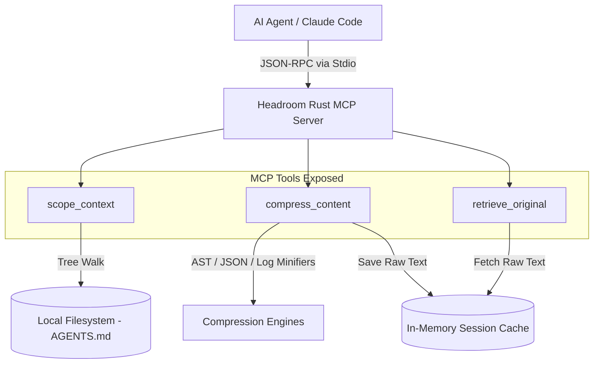

<p align="center">
  
</p>

<p align="center"><strong>A high-performance, zero-dependency context compression layer and DOX scoping companion for AI coding agents, implemented as a native Rust MCP Server.</strong></p>

<p align="center">
  <a href="https://github.com/aswin402"></a>
  <a href="https://github.com/agent0ai/dox"></a>
  <a href="https://github.com/chopratejas/headroom"></a>
</p>

---

## What It Does

**Headroom MCP** sits between your AI coding agent (like Claude Code, Claude Desktop, Cursor, or Aider) and your workspace. It dynamically manages the context window of your LLM sessions using two main strategies:
1. **Dynamic Context Scoping (DOX Pattern):** Prevents loading massive global instructions. When you edit a file, it resolves the file's path, walks up the folder tree, and aggregates only the relevant hierarchical `AGENTS.md` developer rules.
2. **Reversible Local Compression (CCR):** Compresses heavy JSON payloads, source code AST structures, and verbose compiler log traces, substituting them with short summaries and reference tags (e.g. `[CCR Ref: ccr_8f29]`). If the agent needs details later, it calls the `retrieve_original` tool to fetch the raw text from a high-speed local memory cache.

---

## Features

*   **Recursive Directory Scoping (`DOX`):** Automatically aggregates localized developer rules from the root `AGENTS.md` down to the target folder, preventing rule dilution and context window bloat.
*   **JSON Array Crusher:** Summarizes large arrays of JSON objects by extracting unique schemas and printing just the first element, saving up to 90% tokens on structured data.
*   **AST-Aware Code Minifier:** Strips single-line and multi-line comments, docstrings, and collapses empty whitespace to shrink files down to their core structural logic.
*   **Log Purger:** Automatically strips ANSI escape/color sequences, removes repetitive output lines, and keeps only the beginning and trailing log snippets.
*   **Reversible CCR Storage:** Safe, non-lossy prompt compression. The original verbose contents are indexed in an in-memory cache and retrieved by the LLM on-demand.
*   **Zero External Dependencies:** Built entirely in native Rust. No PyTorch, Python runtimes, Node.js packages, or Docker containers required.

---

## Architecture & Data Flow



---

## Execution Workflow

1.  **Context Scoping:** The agent is asked to edit `src/auth/login.rs`. It invokes `scope_context(target_path: "src/auth/login.rs")`. The server traverses upward, reading `src/auth/AGENTS.md`, `src/AGENTS.md`, and the root `AGENTS.md`, returning a combined rules block.
2.  **Compression Interception:** The agent runs a test suite generating 50,000 characters of compiler logs. It calls `compress_content(raw_text: "...", content_type: "text_logs")`.
3.  **Local Indexing:** The server processes the logs, caches the original 50,000-character payload, and returns a 1,500-character summary + `[CCR Ref: ccr_7a1b]`.
4.  **On-Demand Retrieval:** If the agent encounters a compile error referencing a missing symbol and needs to inspect the full trace, it invokes `retrieve_original(ccr_id: "ccr_7a1b")` to fetch the raw logs.

---

## Technical Specifications & Resource Footprint

Unlike original Python implementations that require heavy machine learning libraries (PyTorch, Transformers, HuggingFace downloads) and run slowly on standard hardware, Headroom MCP is optimized for maximum efficiency:

| Metric | Headroom MCP (Rust) | Python Alternatives (with ML) |
| :--- | :--- | :--- |
| **Startup Time** | **&lt; 2 ms** (Instantaneous) | ~1.5 - 3.0 seconds (due to Python import delays) |
| **RAM Footprint** | **&lt; 10 MB** | ~1.5 GB - 2.5 GB (PyTorch memory allocation) |
| **ROM / Binary Size** | **~3.2 MB** (Self-contained) | &gt; 1.5 GB (including standard ML dependencies) |
| **CPU Usage** | **Near-Zero** (Only active on execution) | Heavy (due to PyTorch thread pools) |
| **Execution Latency**| **Sub-millisecond** per minification | 50ms - 300ms per compression pass |
| **Portability** | Single binary (Windows, macOS, Linux) | Prone to platform-specific compile failures |

---

## AI Client Configuration

To load the server into your agent client, compile the release binary:

```bash
cargo build --release
```

Then add the compiled binary to your configuration:

### 1. Claude Desktop
Add to your `claude_desktop_config.json` (Mac: `~/Library/Application Support/Claude/claude_desktop_config.json`, Windows: `%APPDATA%/Claude/claude_desktop_config.json`):

```json
{
  "mcpServers": {
    "headroom-rust": {
      "command": "/path/to/project/target/release/headroom-mcp"
    }
  }
}
```

### 2. Claude Code
Run the registration command in your terminal:
```bash
claude mcp add headroom-rust /path/to/project/target/release/headroom-mcp
```
