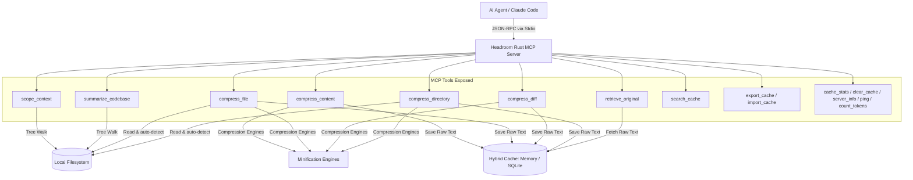

<p align="center">
  
</p>

<p align="center"><strong>A high-performance, zero-dependency context compression layer and DOX scoping companion for AI coding agents, implemented as a native Rust MCP Server.</strong></p>

<p align="center">
  <a href="https://github.com/aswin402"></a>
  <a href="https://github.com/agent0ai/dox"></a>
  <a href="https://github.com/chopratejas/headroom"></a>
</p>

---

## What It Does

**Headroom MCP** sits between your AI coding agent (like Claude Code, Claude Desktop, Cursor, or Aider) and your workspace. It dynamically manages the context window of your LLM sessions using two main strategies:
1. **Dynamic Context Scoping (DOX Pattern):** Prevents loading massive global instructions. When you edit a file, it resolves the file's path, walks up the folder tree, and aggregates only the relevant hierarchical rules (`AGENTS.md`, `CLAUDE.md`, `CURSOR.md`, `.cursorrules`).
2. **Reversible Local Compression (CCR):** Compresses heavy JSON payloads, CSV data, source code, and verbose compiler log traces, substituting them with short summaries and reference tags (e.g. `[CCR Ref: ccr_8f29_1]`). If the agent needs details later, it calls the `retrieve_original` tool to fetch the raw text from a high-speed local memory cache.

---

## Features

*   **Recursive Directory Scoping (`DOX`):** Automatically aggregates localized developer rules from the root down to the target folder, preventing rule dilution and context window bloat. Supports `AGENTS.md`, `CLAUDE.md`, `CURSOR.md`, and `.cursorrules`.
*   **JSON Array Crusher:** Summarizes large arrays of JSON objects by extracting unique schemas and printing just the first element, saving up to 90% tokens on structured data.
*   **AST-Aware Code Minifier:** Strips C-style comments (`//`, `/* */`), Python/Shell hash comments (`#`), SQL comments (`--`), HTML comments (`<!-- -->`), and collapses empty whitespace.
*   **Log Purger & Deduplicator:** Automatically strips ANSI escape/color sequences, deduplicates consecutive duplicate log lines (replacing them with `[repeated N times]` labels), and keeps the beginning and trailing log snippets.
*   **CSV Crusher:** Summarizes CSV datasets by displaying headers, the first three rows, and total row counts.
*   **Reversible CCR Storage:** Safe, non-lossy prompt compression. The original verbose contents are indexed in a high-speed, thread-safe memory cache and retrieved by the LLM on-demand.
*   **Memory Bounded Cache (LRU):** Employs size-based LRU cache eviction limiting memory footprint to a maximum of 100MB.
*   **Auto-detection of Content Types:** Autodetects content structure or resolves file extensions automatically to apply the correct compression algorithm.
*   **Configurable Compression Thresholds:** Supports custom limits per request so clients can dynamically tune minification behavior.
*   **Zero External Dependencies:** Built entirely in native Rust. No PyTorch, Python runtimes, Node.js packages, or Docker containers required.

---

## Architecture & Data Flow



---

## Execution Workflow

1.  **Context Scoping:** The agent is asked to edit `src/auth/login.rs`. It invokes `scope_context(target_path: "src/auth/login.rs")`. The server traverses upward, reading `src/auth/.cursorrules`, `src/CLAUDE.md`, and root rules, returning a combined rules block.
2.  **Compression Interception:** The agent runs a test suite generating 50,000 characters of compiler logs. It calls `compress_content(raw_text: "...", content_type: "auto")`.
3.  **Local Indexing:** The server processes the logs, caches the original 50,000-character payload, and returns a 10,000-character summary + `[CCR Ref: ccr_7a1b_0]`.
4.  **On-Demand Retrieval:** If the agent encounters a compile error referencing a missing symbol and needs to inspect the full trace, it invokes `retrieve_original(ccr_id: "ccr_7a1b_0")` to fetch the raw logs.

---

## Tools Exposed

| Tool | Parameters | Description |
| :--- | :--- | :--- |
| `scope_context` | `target_path` | Walks directory hierarchy to aggregate rules files (AGENTS.md, CLAUDE.md, etc.). |
| `compress_content` | `raw_text`, `content_type`, `threshold` (optional), `preview` (optional) | Compresses raw text dynamically and caches the original content. |
| `retrieve_original` | `ccr_id` | Retrieves original uncompressed content or reads a workspace file. |
| `compress_file` | `file_path`, `content_type` (optional), `threshold` (optional), `preview` (optional) | Reads a file from workspace, compresses, caches, and returns CCR reference. |
| `compress_diff` | `diff_text`, `preview` (optional) | Parses unified diffs, counts insertions/deletions/hunks, and formats a summary. |
| `compress_directory` | `dir_path`, `extensions` (optional), `max_depth` (optional), `preview` (optional) | Walks a directory recursively, compressing and caching each text file. |
| `summarize_codebase` | `root_path` (optional) | Analyzes codebase type, files, line counts, and outputs a formatted folder structure tree. |
| `search_cache` | `query`, `max_results` (optional) | Searches cached entries by keyword using FTS5 SQLite index or substring matching. |
| `export_cache` | `file_path` | Dumps the entire cache to a portable JSON file inside the workspace. |
| `import_cache` | `file_path` | Restores cache entries from a previously exported JSON file. |
| `cache_stats` | None | Returns cache item count, total bytes, and active CCR IDs. |
| `clear_cache` | None | Empties the cache to release memory. |
| `server_info` | None | Returns version, uptime, cache usage, cumulative metrics, and configuration. |
| `ping` | None | Health check. Returns `"ok"`. |
| `count_tokens` | `text` | Estimates the token count for a given text. |

---

## Configuration & CLI Flags

You can customize Headroom MCP via command-line arguments or environment variables:

| CLI Argument | Environment Variable | Default | Description |
| :--- | :--- | :--- | :--- |
| `--log-threshold` | `HEADROOM_LOG_THRESHOLD` | `50000` | Log compression threshold in characters. |
| `--json-threshold` | `HEADROOM_JSON_THRESHOLD` | `10000` | JSON compression threshold in characters. |
| `--max-input-size` | `HEADROOM_MAX_INPUT` | `10MB` | Maximum allowed input size in bytes. |
| `--max-cache-bytes` | `HEADROOM_MAX_CACHE_MB` | `100MB` | Maximum cache size in bytes before LRU eviction. |
| `--workspace-root` | `HEADROOM_WORKSPACE` | Current dir | Active workspace root directory (sandboxing root). |
| `--db-path` | `HEADROOM_DB_PATH` | None | SQLite database path for persistent cache (activates SQLite backend). |
| `--cache-ttl-hours` | `HEADROOM_CACHE_TTL_HOURS` | `0` | Cache entry TTL in hours (0 = no expiry). |
| `--metrics-interval` | `HEADROOM_METRICS_INTERVAL` | `0` | Periodic JSON metrics emission to stderr in seconds (0 = disabled). |

---

## Technical Specifications & Resource Footprint

Unlike original Python implementations that require heavy machine learning libraries (PyTorch, Transformers, HuggingFace downloads) and run slowly on standard hardware, Headroom MCP is optimized for maximum efficiency:

| Metric | Headroom MCP (Rust) | Python Alternatives (with ML) |
| :--- | :--- | :--- |
| **Startup Time** | **&lt; 2 ms** (Instantaneous) | ~1.5 - 3.0 seconds (due to Python import delays) |
| **RAM Footprint** | **&lt; 10 MB** | ~1.5 GB - 2.5 GB (PyTorch memory allocation) |
| **ROM / Binary Size** | **~3.2 MB** (Self-contained) | &gt; 1.5 GB (including standard ML dependencies) |
| **CPU Usage** | **Near-Zero** (Only active on execution) | Heavy (due to PyTorch thread pools) |
| **Execution Latency**| **Sub-millisecond** per minification | 50ms - 300ms per compression pass |
| **Portability** | Single binary (Windows, macOS, Linux) | Prone to platform-specific compile failures |

---

## AI Client Configuration

To load the server into your agent client, compile the release binary:

```bash
cargo build --release
```

Then add the compiled binary to your configuration:

### 1. Claude Desktop
Add to your `claude_desktop_config.json` (Mac: `~/Library/Application Support/Claude/claude_desktop_config.json`, Windows: `%APPDATA%/Claude/claude_desktop_config.json`):

```json
{
  "mcpServers": {
    "headroom-rust": {
      "command": "/path/to/project/target/release/headroom-mcp"
    }
  }
}
```

### 2. Claude Code
Run the registration command in your terminal:
```bash
claude mcp add headroom-rust /path/to/project/target/release/headroom-mcp
```
